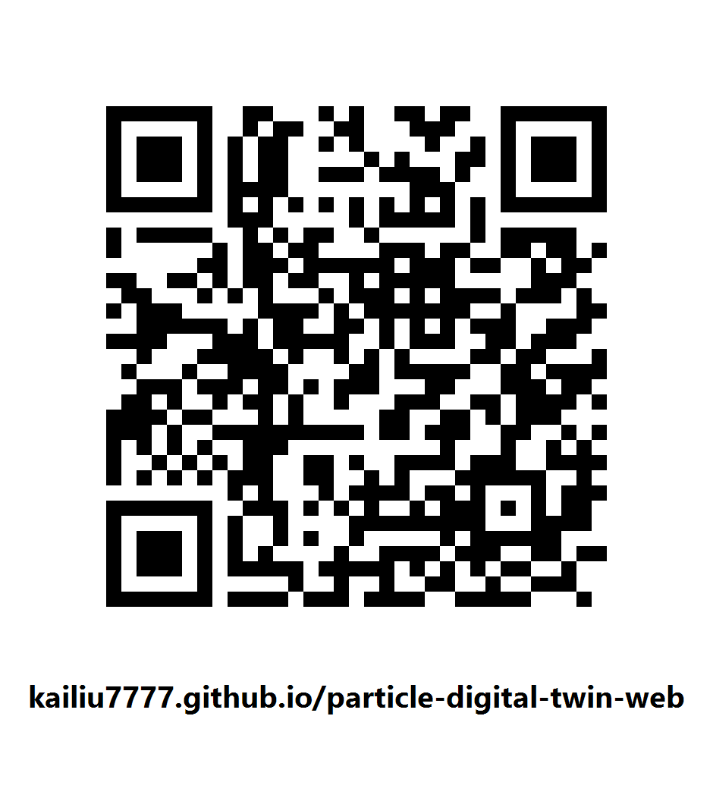

# Compositional AI Digital Twin — web version

Browser version of the Particle Digital Twin: a real-time interactive demonstration of particle-scale flow built from learned, compositional flow operators. Open it on a phone at

**https://kailiu7777.github.io/particle-digital-twin-web/**

It is a simple demonstration for trial, not the qualified desktop application, and it does not claim that particle-resolved DNS runs in real time.

## Using it

- Drag empty space to orbit, pinch to zoom, drag a particle to move it.
- **+** spawns a particle at a held touch, **−** deletes half, **?** opens the gesture board.
- The sun/moon switch beside the close button chooses a light or dark interface; the choice is remembered on that device. The simulation viewport stays dark in both, because tracer and slice shading carry physical meaning that a light background would obscure.
- With the front camera enabled: right hand OK-pinch grabs, thumb–middle pinch spawns, snap removes half; left hand OK-pinch orbits and zooms, point up or down spins the held particle. Camera frames never leave the device.
- The control sheet selects the model (POINT / NEURAL), the wake solver, tracers (OFF / NEAR / SELECTED), six axis-aligned views, the particle limit (8 / 16 / 32) and the slice plane.
- Closing with the × first offers a short optional "Any issues?" check. Nothing has to be selected; one tap on Exit always leaves.

Needs WebGL2 (any current iPhone, Android or desktop browser). Browsers without it get a recorded playback.

## Privacy

Anonymous aggregate usage and optional exit-issue counts help improve this demo. No cookies, persistent identifiers, camera frames, hand data, or precise location are stored.

## What is in this repository

- `index.html` — the page.
- `live/<release>/Build/` — the Unity WebGL2 build (sphere-only, one network).
- `live/<release>/handtracking/` — the vendored MediaPipe Hand Landmarker (`PROVENANCE.md`, `SHA256SUMS`; the page verifies the model digest before use).
- `live/<release>/guide/`, `live/<release>/lite-hand-tracker.js` — gesture board pictures and the tracker.
- `fallback/` — recorded playback for browsers without WebGL2.
- `SHA256.txt` — every file with its SHA-256.
- `retired/` — a record of superseded public releases; their files stay in place unmodified.

The native desktop packages are distributed separately.
